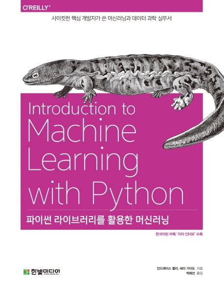

# [ Book ] 파이썬 라이브러리를 활용한 머신러닝
 
** Book 시리즈 ** : 책의 예제 코드를 직접 실습해보며, 학습 기록을 남긴다. 
실습하며 학습했던 코드와 정리한 주석들을 나중에 보면 도움이 된다. 
 
 
 
[공식 참고자료]: https://github.com/rickiepark/intro_ml_with_python_2nd_revised
